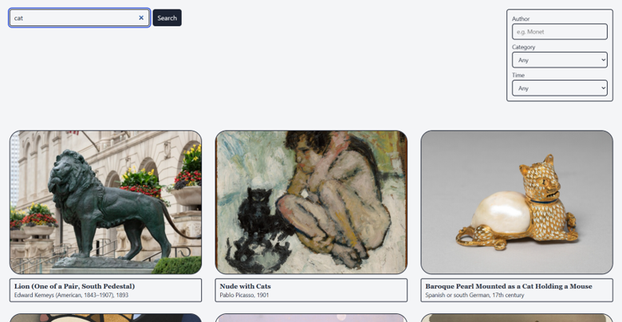

# Day 1 "before" snapshot

Write your own, even if you worked in a pair. Keep it: we come back to it at mid-quarter (Week 6) and at the end (Week 11). Your prompts go in `ai_log.md`, not here.

**Name:Alex Wang**
**Partner (if any):Bingli Guo**

## Before we prompted

### 1. Who is it for, and what do they want to do?

This page is for who want to look up a certain category of artwork and get a image and basic information

**"The user can..." sentences:**
1.search for certain type of artwork and get result
2.filter the artwork by time, author, type etc

### 2. Our sketch

Put the photo in this `hw0` folder, then change the filename below to match:

### 3. Our prediction

We expect the app would have a search bar on the top left corner and a filter bar on the right, below are image and info of the artwork that the user searched.

## What we got

### 4. What the AI made

Put the screenshot in this `hw0` folder, then change the filename below to match:

### 5. Sketch vs. app

The output is relatively identical to our sketch, Claude has made all the requirement that we asked it to do without adding anything not mentioned or that is different to our design

### 6. What did I keep, change, or reject, and why?
I kept everything claude genarated since it perfectly matched our design and did not add or miss anything

### 7. Explain back

Pick one part of the code. In your own words, what does it do?
 

    <label>Author <input id="author" placeholder="e.g. Monet"></label>
    <label>Category
      <select id="category">
        <option value="">Any</option><option>Painting</option><option>Sculpture</option>
        <option>Print</option><option>Photograph</option><option>Textile</option>
        <option>Drawing and Watercolor</option>
      </select>
    </label>
    <label>Time
      <select id="time">
        <option value="">Any</option><option value="-5000,1499">Before 1500</option>
        <option value="1500,1799">1500–1799</option><option value="1800,1899">1800s</option>
        <option value="1900,1999">1900s</option><option value="2000,2100">2000 onward</option>
      </select>
    </label>
  

The filter and the options, filters the art work by different categories
## Looking ahead

### 8. What does it do? Does it work? What broke?
It enables the user to search a spcific or a certain type of artwork within the Art Institute of Chicago. It worked as intended and nothing broke

### 9. How much do I understand about how it works? (0–100%)

**My number:80%**

**Why that number:I understand most of the code when looking at it, but I wouldn't be able to write my own version or debug or make major adjustment to it**

### 10. What would I need to know to tell whether it's *well designed or well built*?
If the interface is clear or easy to understand, and it's easy for user to find what they need

### 11. What do I hope to be able to do by week 10?
build something that is complete and have more functions, not just this simple demo

